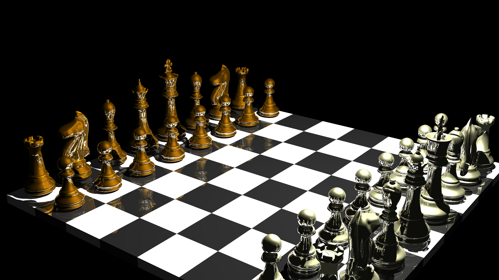
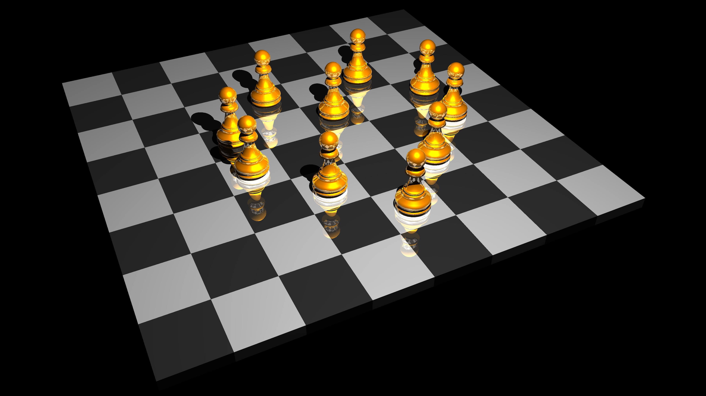
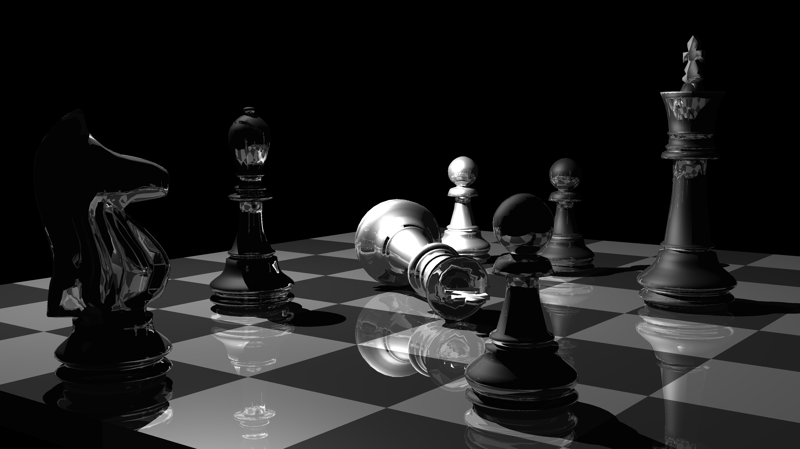
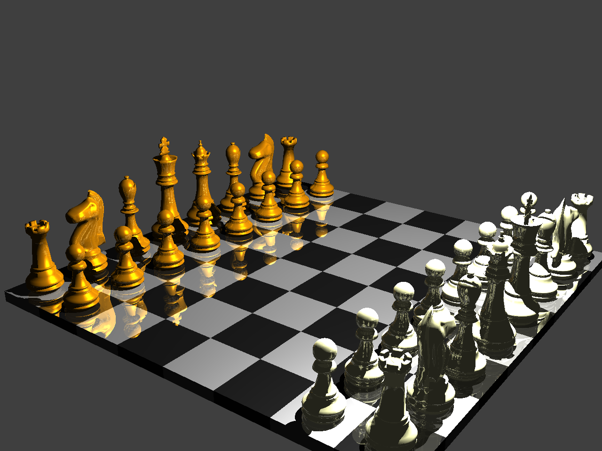
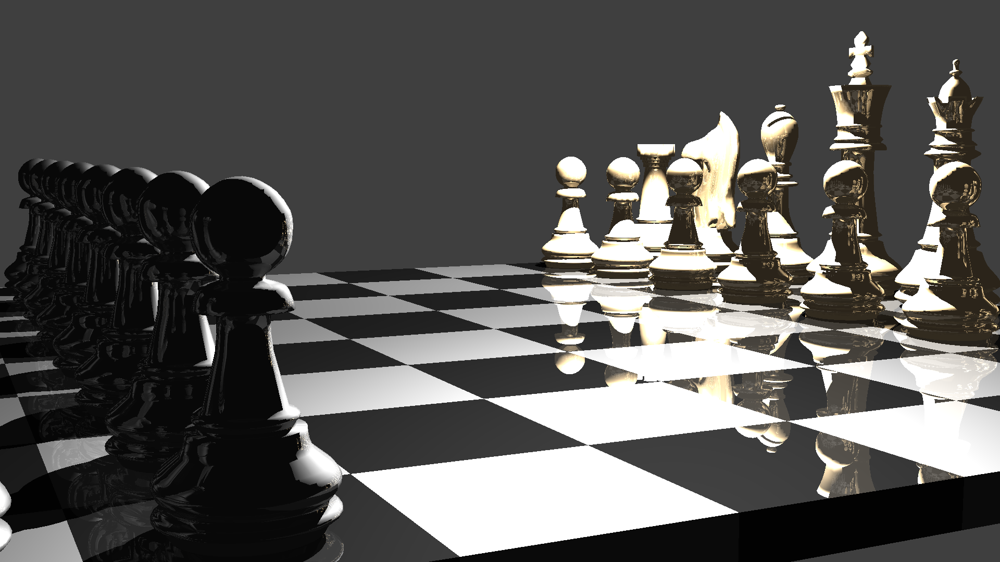
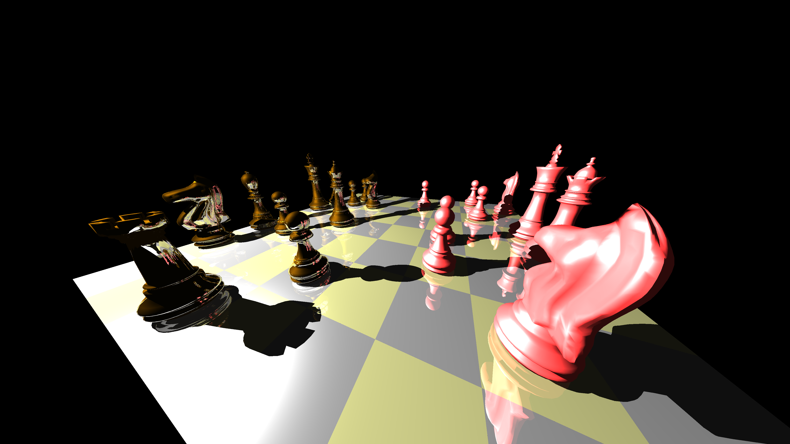
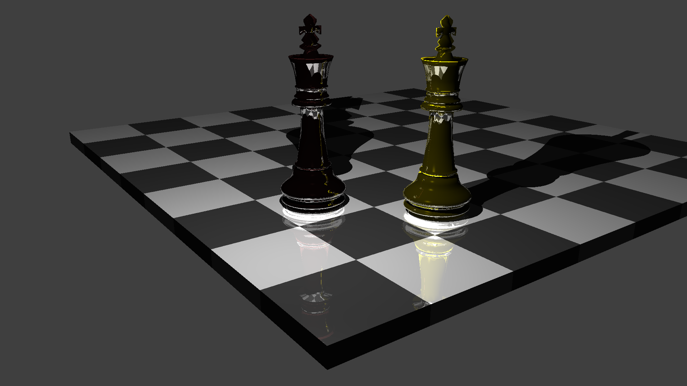

# Chess renderer using ray traycing

This project was the main deliverable of the winter semester course Computer graphics. The application is capable of rendering the chessboard with arbitrarily placed pieces, it uses the Phong shading model and supports shadows and reflections. Only the .OBJ model files are supported.

## How it works?

Classical ray tracing approach is used. As the computation of the intersections with the model's triangles represents the most significant bottleneck of the application, the method Fast Minimum Storage Ray/Triangle Intersection was implemented. The bounding boxes are used as well.

## Dependencies

- MSVC compiler
- Eigen

## Configuration

It is possible to set the camera's resolution and FOV, the position of the light in the scene, background color, recursion depth of ray tracing, the colors of the pieces and chessboard fields as well as the reflectance and the shininess. Regarding the chessboard model, the user can set the position of each piece. Both the renderer and the model configuration can be done using the files *configChessDefault* and *configRTDefault*.

## Install and run

1. Open rtchess.sln with Visual Studio
2. Compile (Release mode is recommended)
3. Run (see synopses)

The program uses free model file chess.obj (by [author cjx3711](http://www.turbosquid.com/FullPreview/Index.cfm/ID/544320)). It is possible to use your own but the program expects the separated models (chess pieces and chessboard) to follow specific name convention (see the chess.obj model file).

## Synopsis
```
rtchess model config_chessboard config_ray_tracer output

     model               model file name (.OBJ)
     config_chessboard   chessboard configuration file
     config_ray_tracer   ray tracer configuration file
     output              output file (.PPM)
```

## Authors
* Jan Bednarik - jan.bednarik@hotmail.cz
* Jakub Kvita  - kvitajakub@gmail.com

## Gallery







